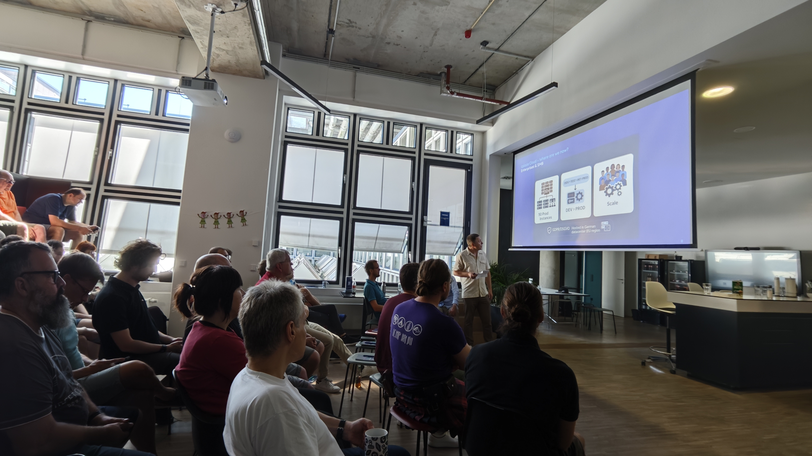
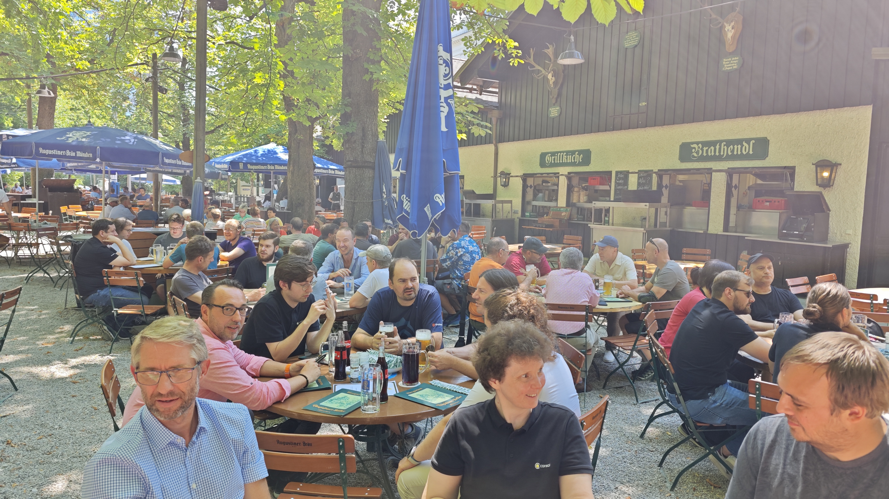
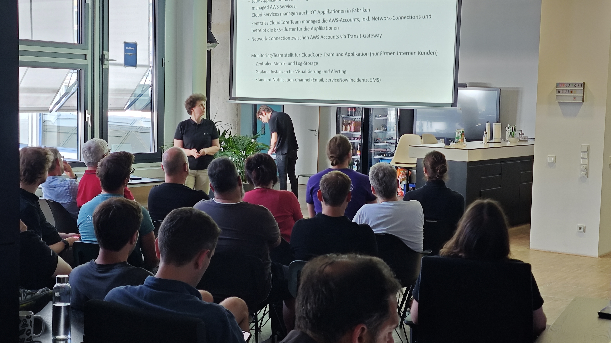
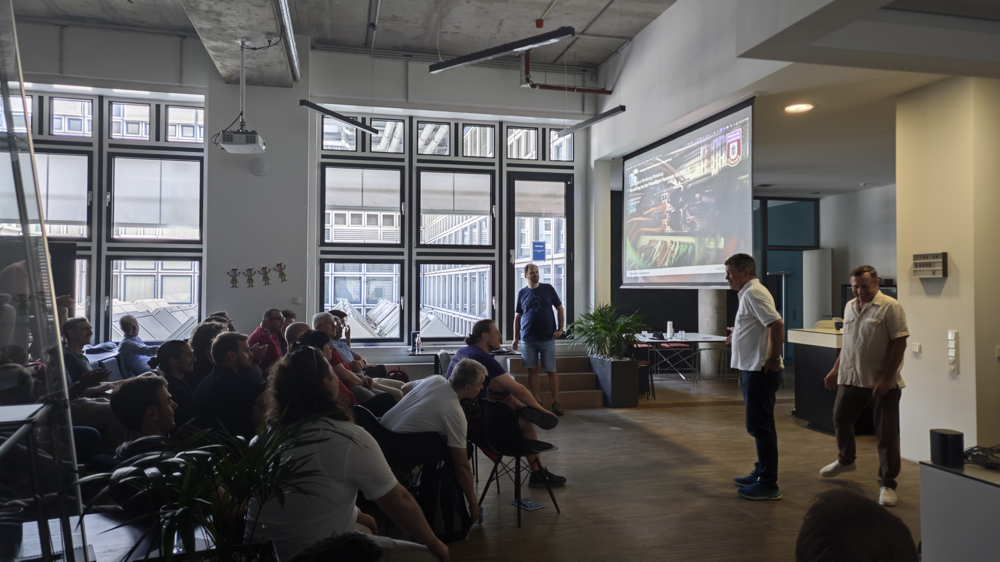
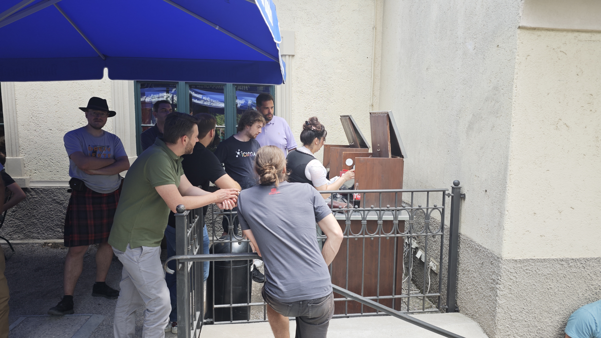

## Spoiler: Schee war's
Das 16. Treffen der deutschsprachigen Open-Source-Monitoring-Community fand am 2. und 3. Juli in München statt. Gastgeber war die [collaboration Factory GmbH](https://www.cplace.com/), die ihren Loft in der neuen Hopfenpost am Hauptbahnhof (sogar mit Tribüne) zur Verfügung stellte. Beziehungen muss man haben...  
Der Workshop brachte wie immer Monitoring-Admins und Software-Autoren zusammen, die sich in ihren Vorträgen über neue Entwicklungen und Anwendungen in die Karten schauen lassen. In München bieten sich natürlich Biergartenbesuche zum geselligen Austausch an, auch davon wurde mehrmals Gebrauch gemacht.

---

## Tag 1 - 2. Juli - 34,3 °C

Nach der Begrüßung der ca. 50 Teilnehmer folgte die Keynote von Marco Pasti von der collaboration Factory GmbH. Er stellte **cplace** vor, das Flaggschiff des Unternehmens, das sich zunehmend auch als Bezeichnung für die gesamte Firma etabliert. Basierend auf einem flexiblen Datenmodell wird cplace von namhaften Konzernen für Projekt-, Portfolio- und Ressourcenplanung eingesetzt. Marco erläuterte, wie cplace durch drei Schichten unterschiedlicher Komplexität an beliebige Szenarien angepasst werden kann:  
- **No-Code**: Konfigurationseinstellungen und mitgelieferte Widgets ermöglichen einfache Anpassungen ohne Programmierkenntnisse.  
- **Low-Code**: Ergänzung der Basissoftware mit JavaScript-Funktionen, z.B. für Prozessautomatisierung und Datenimport.  
- **Pro-Code**: Implementierung gänzlich individueller Features direkt im Java-Code von cplace, z. B. für nicht standardmäßige API-Abfragen und Anbindungen von Fremdsystemen.  

Die Software kann On-Premise, aber der Trend geht klar zu gehosteten Installationen, denn der Betrieb der Plattform durch die cplace-Kunden selbst bedeutet für diese Aufwand in Form von Zeit und Hardware und geht zu Lasten des Kerngeschäfts.  
Man merkte, dass bei cplace Technikbegeisterung herrscht, genau wie bei den Workshopteilnehmern.

---

**Softwareentwicklung in einem Open-Source-Unternehmen - Blerim Sheqa, NETWAYS**  
Blerim Sheqa von NETWAYS gab Einblicke in die Softwareentwicklung in einem Open-Source-Unternehmen. NETWAYS lagerte nach dem Fork von Icinga die Entwicklung in ein eigenes Unternehmen aus. Blerim erzählte von der Herausforderung, individuelle Kundenwünsche in Benefits für die Gesamtheit der Anwender umzuwandeln und sich dem Prinzip „wer zahlt schafft an“ zu verweigern, um glaubhaft zu bleiben. Die Balance zwischen Kundenwünschen und Community-Interessen zu halten ist nicht leicht.  
Blerim unterstrich, was man nicht oft genug betonen kann: Open-Source ist gratis, aber nicht kostenlos. Irgendjemand muss das ja alles entwickeln und supporten und hätte am Monatsende gern ein Gehalt auf dem Konto.  

---

**Monitoring bei cplace - Sebastian Weitzel, cplace**  
Sebastian Weitzel, unterstützt von Martin Rauch und Frank Büttner, alle drei von cplace, stellte die Herausforderungen und die Erkenntnisse beim Monitoring der Plattform vor. Der Vortrag zeigte, wie wichtig eine enge Zusammenarbeit zwischen Entwicklung und Betrieb ist. An mehreren Beispielen wurde verdeutlicht, wie das Bereitstellen von Metriken durch die Applikation hilft, die Performance zu verbessern und Fehlern auf die Spur zu kommen.  
Insbesondere als Anbieter einer gehosteten Applikation as-a-service hilft Monitoring, Probleme bei Softwareupdates zu erkennen, bevor dieses auf alle Kundeninstallationen ausgerollt wird.

---

**Mittagessen im Augustiner Biergarten**  
Das Foto sagt wohl alles. Es war ein ziemlich heißer Sommertag.  

---

**Umbrella Monitoring - Jens Michelson, Allgeier**  
Jens Michelson, Produktmanager von openITCOCKPIT, ließ Bastlerherzen höher schlagen. Er monitort sein Balkonkraftwerk wie andere ihr Rechenzentrum, mit detaillierten Metriken und Dashboards. Dazu zapft er die Api seines Home Assistant mit openITCOCKPIT an.  
Balkone sind weit verbreitet, Balkonkraftwerke mittlerweile auch immer mehr, aber wer Monitoring-Know-How besitzt, kann mehr draus machen. Was dem einen die Geranienkästen, sind dem anderen die Dashboards. Jens hatte am Abend viele neugierige Fragen zu beantworten.   

---

**Cloud-Monitoring bei einem Elektrokonzern - Ulrike Klusik, ConSol**  
Ulrike Klusik präsentierte eine beeindruckende Monitoringplattform, die sie bei einem großen deutschen Elektrokonzern aufgebaut hat. Applikationen, die in beliebigen EKS-Clustern deployed werden, können diese ohne großen Aufwand nutzen. Operators erstellen dazu die nötigen Ressourcen in den Kunden-Deployments, um Metriken und Logs zu einem hochverfügbaren Loki- und VictoriaMetrics-Cluster des Monitoring-Teams zu senden.  
Die Plattform basiert zu 100% auf Open-Source-Komponenten (läuft auf AWS, vermeidet aber dessen teure Builtin-Produkte) und nimmt Kunden das Problem, sich selbst um einen Langzeitspeicher und Guis für ihre Monitoringdaten kümmern zu müssen.  
Wie immer, wenn Ulrike Einblick in ihre Setups gibt, klappten die Kinnladen runter.  

---
  
**Grußwort vom CEO - Dr. Rupert Stuffer, cplace**  
Nach Ulrike Klusiks Vortrag sorgte Dr. Rupert Stuffer, CEO von cplace, für einen herzlichen Moment. Er war in seinem Büro auf die vielen Menschen aufmerksam geworden, die sich quasi in seinem Wohnzimmer breit gemacht hatten.  
Er ließ es sich nicht nehmen, ein paar wertschätzende Worte an die Teilnehmer zu richten. Er hatte wohl gespürt, daß es sich um Leute handelte, die sich getroffen hatten, um durch offenen Austausch unter Gleichgesinnten neue Ideen zur Verbesserung ihrer Arbeit mitzunehmen.

---

**Monitoring bei der Freiwilligen Feuerwehr München - Basti Schubert**  
Basti Schubert, beruflich Solutions Engineer bei Grafana, engagiert sich seit frühester Jugend bei der Freiwilligen Feuerwehr München, wo er die EDV-Infrastruktur betreut. Sein Vortrag fokussierte auf einfache, nachvollziehbare und robuste Setups, die mit wenig Aufwand wartbar sind. Nachvollziehbar, da all das ehrenamtlich in der knappen Freizeit gemacht wird.  
Beeindruckend war, wie Basti eine IT-Infrastruktur aufgebaut hat, welches nicht mal Berufsfeuerwehren mit zigfachem Budget hinbekommen.  

---

**Lightning Talk: Wie man einen Synthetic Test mit dem Robot Framework entwickelt - Simon Meggle, elabit**  
Simon erzählte die Geschichte von armen Rudi, der für das Beschwerdeformular eines Webauftritts verantwortlich ist, bei dem etwas faul ist. Immer wieder kommt es vor, daß Beschwerden nach dem Absenden im Nirvana verschwinden. Eigentlich sollten sie alle in einer Liste im Admin-Webinterface sichtbar sein.  
Rudis Chef setzt ihn stark unter Druck, aber Rudi findet Hilfe in Form des Robot Frameworks. Mit diesem kann man auch ohne tiefgreifende Programmierkenntnisse sog. synthetische Tests erstellen. Rudi schreibt einen Test, der einen wütenden Kunden simuliert, welcher eine Beschwerde abschickt und sodann prüft, ob sie in der Admin-GUI angekommen ist. Mit derlei Scripts lassen sich webbasierte Interaktionen rund um die Uhr automatisiert ausführen, um Fehlern auf die Spur zu kommen.  

---

Am Ende des ersten Tages schlug beim Verlassen der Neuen Hopfenpost erneut die erbarmungslose Sommerhitze zu. Wir marschierten Richtung Löwenbräukeller am Stiglmairplatz, wo das Bier in ausgedörrte Kehlen rann und dabei ein Geräusch verursachte, das so ähnlich wie „coshsh“ klang. Ich kann die Schweinshaxn dort empfehlen.   

## Tag 2 - 3. Juli - 23 °C
---

**Netdisco und Icinga im Team - Hajo Kessener, Uni Hannover**
Hajo Kessener, ein IT-Urgestein von Leibniz Universität Hannover IT Services, präsentierte, wie er die Netzwerklandschaft der Universität mit Netdisco automatisch kartographiert. Hajo pumpt anschließend per Skript diese Daten, aufbereitet als Hosts und Services, zum Icinga-Director, um sein Monitoring stets aktuell zu halten. Sein Ansatz zeigt, wie Open-Source-Tools kombiniert werden können, um komplexe Netzwerke zuverlässig zu überwachen.  
Netdisco findet alle IP-Adressen, bohrt dann tiefer und kann mit Hilfe der Mac-Adressen sagen, wer mit wem kommuniziert bzw. welches Gerät an welchem Switch/Controller angeschlossen ist. Mit Hilfe solcher Informationen lassen sich sogar vermisste oder auch geklaute Endgeräte aufspüren.  
Eine weitere Erkenntnis nach Zuruf aus dem Publikum: "Python ist älter als Perl".  
Ich hatte mich gefreut, dachte "Wenn mir nochmal einer blöd kommt...". Genauere Recherchen belegen aber, daß leider doch Perl die ältere Sprache ist. (Es gibt Spekulationen, daß Python anfangs intern und undokumentiert entwickelt wurde und mindestens so alt ist wie Perl, Belege dafür gibt es aber nicht)

---

**Prometheus und SNMP - Gerhard Laußer, ConSol**  
Ich wollte ursprünglich zeigen, wie Netzwerkgeräte vorab auf bestimmte Mibs/Tables/OIDs gescannt werden, um Module für den snmp_exporter zu erstellen, die nur die nötigsten SNMP-Walks/Gets ausführen. Leider scheiterte die Demo: Der verwendete SNMP-Simulator benötigte 15 Sekunden pro Request und war unbrauchbar. Plan B, ein Setup zu zeigen, bei dem Windows-Eventlogs mit Alloy an einen Loki gesendet werden, scheiterte an fehlendem Nested KVM auf Hetzner-VMs. Plan C, dasselbe mit Linux-Logs zu zeigen, scheiterte am Vortragstag um 02:00 morgens, da der Linux-Server ein Container mit SNClient als Prozess 1 und ohne Journald – und somit ohne Logs – war. (Klar hätte man etwas mit loki.source.file basteln können, aber das hätte insgesamt zu wenig Substanz gehabt)  
Nachdem die Demo-Pläne nicht funktionierten, entschloss ich mich dazu, das wenige zu zeigen, das entstanden war und ansonsten ohne festgelegtes Ziel und Fokus zu improvisieren.  
Tatsächlich entstand eine überraschend informative Plauderei mit dem Publikum, unterstützt von Sören und Basti, bei der die Zeit im Nu verging.  
Ein Appell von Basti, den man im Hinterkopf behalten sollte: "Finger weg von Streaming Telemetry!"

---

**Mittagessen im Augustiner Biergarten**  
Wie schon am Vortag gingen wir wieder zum Augustiner, diesmal bei sehr angenehmen Temperaturen. Angesichts der üppigen Portionen gab es große Augen.

---

**Icinga Notifications - Eric Lippmann, Icinga**  
Eric Lippmann, CTO von Icinga, stellte „Icinga Notifications“ vor, eine Lösung für die Konfiguration von Benachrichtigungen, die außerhalb des Monitoring-Cores stattfindet. Die Einrichtung von Kontakten, Eskalationen, Bereitschaften und Zeiten ist oft aufwendig, erfordert manchmal Neustarts und ist für Anwender schwer selbstständig umzusetzen.  
Icinga Notifications bietet eine GUI, in der Benutzer einfach selbst festlegen können, wer, wie, wann und bei welchen Störungen benachrichtigt wird.  

---

**Lightning Talk: Performance Data Graphs - Thilo Wening, NETWAYS**  
Zum Abschluss des zweiten Tages präsentierte Thilo Wening eine Alternative zu den eingebetteten Grafana-Panels in Icinga Web, welche sich in einem IFrame befinden müssen und zu denen die Authentifizierung durchgereicht werden muss. Das Web-Modul Performance Data Graphs umgeht diesen Schritt und bietet eine direkte und leichtgewichtige Integration in die Gui.

---

**Fazit**  
Der 16. Open-Source-Monitoring-Workshop 2025 hat viel Spaß gemacht und viel Know How zusammengebracht.  
Wir sehen uns im nächsten Jahr!

