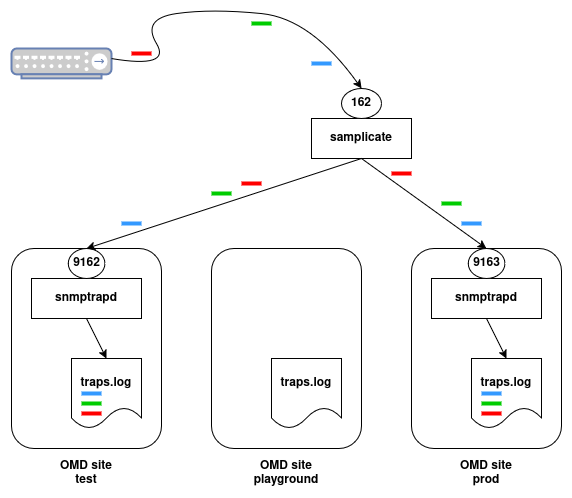

SNMP Traps and Nagios (or any other related systems) is one of those topics that people have often preferred to avoid. Fundamentally, there have been two add-ons available for years, SNMPTT and Nagtrap, but their configuration is somewhat tedious. In a project involving the monitoring of several thousand storage systems, a method was developed that is resource-efficient and easily automatable.

Let's start with a picture. A network device sends traps to the OMD server. Here we have a process [samplicate](https://github.com/sleinen/samplicator) listening on port 162 which duplicates the udp packets and forwards them to the OMD sites which are configured as trap recipients, Such sites have an *snmptrapd* process, which writes the contents of an incoming trap in a logfile, *traps.log*. (we see three traps here, arriving at port 162 in the order blue, green, red. In the same order they arrive at the sites' snmptrap daemons and in the same order they are written to the logfile)  
That's all. Later you will learn how the logfile is scanned for incoming traps, how these are evaluated, how the trap sender is identified among the monitored host objects and how the right service is set into an alarm state.




## Setup trap processing on an OMD server
The first part of this article focuses on preparing an OMD server. Specifically, it explains how to ensure that an incoming trap is simultaneously forwarded to multiple OMD sites (e.g., testing, production, etc.).

First, any existing snmptrapd process must be stopped, and its associated init script or systemd service must be removed. With most distributions this is achieved by running the following commands as the root user:
```bash
[root@pxmxmon]# systemctl stop snmptrapd
[root@pxmxmon]# systemctl disable snmptrapd
```
 A samplicate daemon will take over listening on *udp/162*. The Samplicator project is designed to duplicate UDP packets. When a trap arrives, it is forwarded to local snmptrapd processes running within OMD sites, each of which listens on its own dedicated high port.

A site can be prepared to receive traps using the following command:
```bash
OMD[demo@pxmxmon]:~$ omd config set SNMPTRAPD on
```

OMD automatically assigns a port:

```bash
OMD[demo@pxmxmon]:~$ omd config show SNMPTRAPD_UDP_PORT
9162
```

The first site gets port 9162, and subsequent sites are assigned incrementally higher ports. You don’t need to worry about this numbering; OMD manages it automatically in the background. After restarting the site or running:

```bash
OMD[demo@pxmxmon]:~$ omd start snmptrapd
```

...now there is a snmptrapd runninging the OMD site listening on udp port 9162.

## Setting up the system trap forwarder
Next, the samplicate daemon must be started. A manual step is required because installing OMD as a dependency also installs an snmptrapd package. On some distributions, this triggers the automatic start of the snmptrapd daemon, which is undesired. To ensure the samplicate daemon is running instead (and listening on port udp/162), execute the following commands as the root user:

```bash
[root@pxmxmon]$ /bin/cp /opt/omd/versions/default/share/samplicate/*.service /etc/systemd/system
[root@pxmxmon]$ systemctl enable samplicate_watch
[root@pxmxmon]$ systemctl start samplicate_watch
```

This installs two services:

* **samplicate_watch**: Checks every 60 seconds which OMD sites are running a local snmptrapd listening on which port. If there is a change, it ensures the samplicate service restarts with an updated list of target ports.
* **samplicate**: The service that forwards copies of incoming UDP packets to the local recipients.

What happens when an SNMP trap is received on the OMD server, such as the following example?

```bash
# pxmxmon is the hostname of your monitoring server
$ snmptrap -v 2c -c public pxmxmon \
    '' 1.3.6.1.4.1.8072.2.3.0.1 1.3.6.1.4.1.8072.2.3.2.1 i 12341234
```
The samplicate process will receive the udp packet containing the snmp trap. It will immediately forward a copy of the packet to every target port (aka. local snmptrapd).  
The local (running inside the OMD site(s)) snmptrapd processes are configured to write the trap to a log file located at *$OMD_ROOT/var/log/snmp/traps.log*. Each field is logged on its own line, followed by a summary line that flattens the trap. Here the individual fields are separated by four underscores (____).

For example:
```
[Tue Jan 21 03:19:53 PM CET 2025] .1.3.6.1.2.1.1.3.0: 42095560
[Tue Jan 21 03:19:53 PM CET 2025] .1.3.6.1.6.3.1.1.4.1.0: .1.3.6.1.4.1.8072.2.3.0.1
[Tue Jan 21 03:19:53 PM CET 2025] .1.3.6.1.4.1.8072.2.3.2.1: 12341234
[Tue Jan 21 03:19:53 PM CET 2025] summary: ____lausser.consol.de____UDP: [10.1.18.166]:34300->[127.0.0.1]:9162____.1.3.6.1.2.1.1.3.0 42095560____.1.3.6.1.6.3.1.1.4.1.0 .1.3.6.1.4.1.8072.2.3.0.1____.1.3.6.1.4.1.8072.2.3.2.1 12341234
```
There is also the resolved hostname of the sender node and, inside the first pair of brackets, it's ip address. We will later use this information to identify the host object in the monitoring configs.

> **Note:** If you do not see these lines in your trap.log, then maybe a firewall is blocking the snmp packets from your system. You can repeat the **snmptrap** command and at the same time listen on the network interface of your monitoring server with **tcpdump port 162**.  
If you still can't see anything, then open your firewall. For example on a Rocky Linux system you do it with:
> ```bash
> [root@pxmxmon]$ firewall-cmd --permanent --add-port=162/udp
> [root@pxmxmon]$ firewall-cmd --reload
> ```

In this first test the trap *netSnmpExampleHeartbeatNotification (.1.3.6.1.4.1.8072.2.3.0.1)* from the *NET-SNMP-EXAMPLES-MIB* was sent. For now, we will stick with this MIB before things get complicated.  
In the next part, we will set up everything needed to add a host with a single service to the monitoring system. This service will represent the trap netSnmpExampleHeartbeatNotification and will turn CRITICAL whenever this trap is received.
Technically, this means that the service is configured as a passive service. Meanwhile, the traps.log file is scanned every minute for new entries using the check_logfiles plugin. If a trap is found with a sender IP address matching the host's address in the monitoring configuration and a trap OID corresponding to netSnmpExampleHeartbeatNotification, the check_logfiles plugin submits a CRITICAL passive check result for the service.

Now, we’ll demonstrate how to use coshsh and a MIB file to automatically generate trap services.


## Preparing MIB files for use by coshsh
What we want to achieve is to have coshsh create a service definition (a passive one) for every kind of trap we want to monitor for a certain host or device category.

### Convert MIB to SNMPTT
First we need the command **snmpttconvertmib**, which is part of the *snmptt* suite. Either *snmptt* is available from your distribution's repositories, then install it with **yum** or **apt**. Or you simply download the command from github.

```bash
OMD[demo@pxmxmon]:~$ cd local/bin
OMD[demo@pxmxmon]:~$ curl -O https://raw.githubusercontent.com/snmptt/snmptt/refs/heads/master/snmptt/snmpttconvertmib
OMD[demo@pxmxmon]:~$ chmod 755 snmpttconvertmib
```

```bash
OMD[demo@pxmxmon]:~$ cd etc/coshsh/data/mibs/
OMD[demo@pxmxmon]:~$ mkdir ../snmptt
OMD[demo@pxmxmon]:~$ OMD[demo@pxmxmon]:~/etc/coshsh/data/mibs$ snmpttconvertmib --in=NET-SNMP-EXAMPLES-MIB.txt --out=../NET-SNMP-EXAMPLES-MIB.snmptt

*****  Processing MIB file *****
...
NOTIFICATION-TYPE: netSnmpExampleHeartbeatNotification
Variables: netSnmpExampleHeartbeatRate
Enterprise: netSnmpExampleNotificationPrefix
Looking up via snmptranslate: NET-SNMP-EXAMPLES-MIB::netSnmpExampleHeartbeatNotification
OID: .1.3.6.1.4.1.8072.2.3.0.1

Done

Total translations:        1
Successful translations:   1
Failed translations:       0
```
<!--
SORRY FROM HERE ON THERE IS WORK-IN-PROGRESS BECAUSE I GO HOME NOW AND CONTINUE FROM THERE

As an example we will process traps coming from a SuperMicro server. On the website of the management board, where you enter the snmp trap receiver (which is the ip address of your monitoring server) there is a button *send test trap*. Push this button and you should see a few lines added to your file *traps.log*. (If you don't have such a server, you can use a printer or any other snmp-enabled device. Just pull a plug, open a lid, etc. so that the device will send an snmp trap)

```
[Tue Jan 21 04:44:47 PM CET 2025] .1.3.6.1.2.1.1.3.0: 1737474286
[Tue Jan 21 04:44:47 PM CET 2025] .1.3.6.1.6.3.1.1.4.1.0: .1.3.6.1.4.1.3183.1.1.0.0
[Tue Jan 21 04:44:47 PM CET 2025] .1.3.6.1.4.1.3183.1.1.1: "43 30 30 31 4D 53 AC 1F 6B B7 30 44 00 00 00 00
[Tue Jan 21 04:44:47 PM CET 2025] 00: 04 32 E4 E4 6E FF FF 20 20 02 00 00 00 00 00
[Tue Jan 21 04:44:47 PM CET 2025] 00: 00 00 00 00 00 00 19 7C 2A 00 00 34 08 80 00
[Tue Jan 21 04:44:47 PM CET 2025] 01: 00 C1 "
[Tue Jan 21 04:44:47 PM CET 2025] .1.3.6.1.6.3.18.1.3.0: 10.0.10.118
[Tue Jan 21 04:44:47 PM CET 2025] .1.3.6.1.6.3.18.1.4.0: "public"
[Tue Jan 21 04:44:47 PM CET 2025] .1.3.6.1.6.3.1.1.4.3.0: .1.3.6.1.4.1.3183.1.1
[Tue Jan 21 04:44:47 PM CET 2025] summary: ____proxmox18.consol.de____UDP: [10.0.10.118]:53176->[127.0.0.1]:9162____.1.3.6.1.2.1.1.3.0 1737474286____.1.3.6.1.6.3.1.1.4.1.0 .1.3.6.1.4.1.3183.1.1.0.0____.1.3.6.1.4.1.3183.1.1.1 "43 30 30 31 4D 53 AC 1F 6B B7 30 44 00 00 00 00____00 04 32 E4 E4 6E FF FF 20 20 02 00 00 00 00 00____00 00 00 00 00 00 00 19 7C 2A 00 00 34 08 80 00____01 00 C1 "____.1.3.6.1.6.3.18.1.3.0 10.0.10.118____.1.3.6.1.6.3.18.1.4.0 "public"____.1.3.6.1.6.3.1.1.4.3.0 .1.3.6.1.4.1.3183.1.1
```
The interesting part is the second line. It gives us the OID of the trap we just received: .1.3.6.1.4.1.3183.1.1.0.0  
We must now find the MIB file, where this OID belongs to.  When we google for it, we find multiple MIBs. It looks like this OID is part of *Server Administrator BMC MIB* which is used and renamed by more than one vendor. We just chose this one and download it to the folder *~/etc/coshhs/data/mibs*: [DELL-ASF-MIB](https://github.com/librenms/librenms-mibs/blob/master/DELL-ASF-MIB)  
Now we need to convert this mib to a format which can be processed by coshsh.

```bash
OMD[demo@pxmxmon]:~$ cd etc/coshsh/data/mibs/
OMD[demo@pxmxmon]:~$ mkdir ../snmptt
OMD[demo@pxmxmon]:~$ snmpttconvertmib --in=DELL-ASF-MIB  --out=../snmptt/DELL-ASF-MIB.snmptt


*****  Processing MIB file *****

snmptranslate version: NET-SNMP version: 5.9.1
severity: Normal

File to load is:        ./DELL-ASF-MIB
File to APPEND TO:      ../snmptt/DELL-ASF-MIB.snmptt

MIBS environment var:   ./DELL-ASF-MIB
MIB name:               DELL-ASF-MIB


Processing MIB:         DELL-ASF-MIB
#
skipping a TRAP-TYPE / NOTIFICATION-TYPE line - probably an import line.
#
Line: 36
TRAP-TYPE: asfTrapIPMIAlertTest
Looking up via snmptranslate: DELL-ASF-MIB::asfTrapIPMIAlertTest
OID: .1.3.6.1.4.1.3183.1.1.0.1001

...

#
Line: 1159
TRAP-TYPE: asfTrapInternalDualSDModuleNotRedundant
Looking up via snmptranslate: DELL-ASF-MIB::asfTrapInternalDualSDModuleNotRedundant
OID: .1.3.6.1.4.1.3183.1.1.0.13175555


Done

Total translations:        91
Successful translations:   91
Failed translations:       0
OMD[demo@pxmxmon]:~/etc/coshsh/data/mibs$ 
```

If you see IMPORT statements in the MIB or error messages in snmpttconvertmib's output, then it is probably necessary to add somemore MIB files, until everything can be properly resolved.  
The result of this operation is now a file *~/etc/coshsh/data/snmptt/DELL-ASF-MIB.snmptt*. It contains a section for every trap which was found inthe MIB file.

```
...
EVENT asfTrapFanSpeedWarning .1.3.6.1.4.1.3183.1.1.0.262400 "Status Events" MINOR
FORMAT Generic Predictive Fan Failure ( predictive failure asserted )
SDESC

Generic Predictive Fan Failure ( predictive failure asserted )
Variables:
EDESC
#
#
#
EVENT asfTrapFanSPeedWarningCleared .1.3.6.1.4.1.3183.1.1.0.262528 "Status Events" INFORMATIONAL
FORMAT Generic Predictive Fan Failure Cleared
SDESC

Generic Predictive Fan Failure Cleared
Variables:
EDESC
#
#
#
EVENT asfTrapFanSpeedProblem .1.3.6.1.4.1.3183.1.1.0.262402 "Status Events" CRITICAL
FORMAT Generic Critical Fan Failure
SDESC

Generic Critical Fan Failure
Variables:
EDESC
...
```

What is the meaning of the keywords?
* EVENT - this is the name of the trap, its OID, a fixed string "Status Events" and, very important, the severity. The trap name together with the MIB name will be the base of the future service_description.
* FORMAT - a short description. This will later be used in the notifications.
* SDESC/EDESC - start and end of a longer description.

In this case the MIB contained severity hints. Usually this is not the case and all the EVENT lines will get the severity *NORMAL* first.

-->
