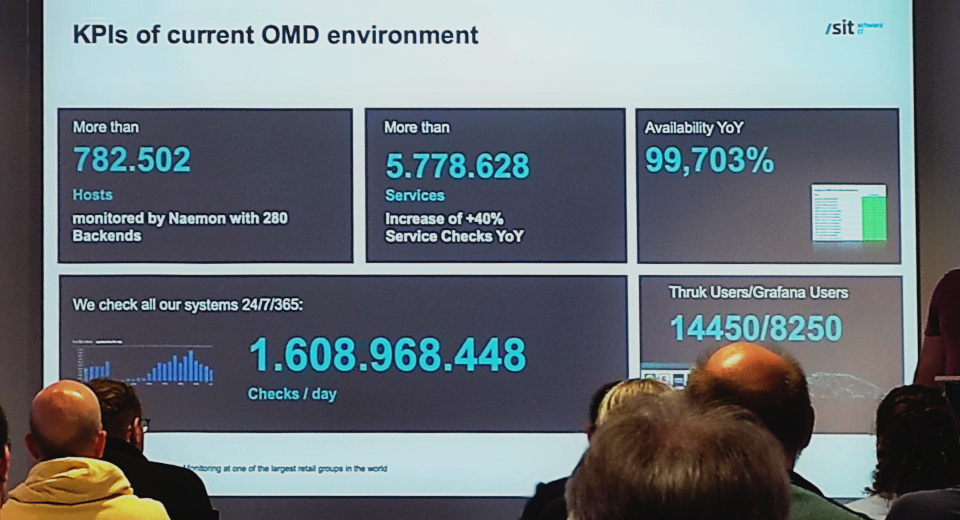

The `OMD Labs-Edition` is a monitoring platform and a new concept of how to install, maintain and update a nagios compatible monitoring system (When we are talking about nagios, we mean nagios-like. Our preferred core is Naemon). It contains most monitoring related components from [omd.consol.de](/) and others useful addons from companioned authors. It is _not_ another linux distribution, instead it integrates well in your current system in form of a single rpm or deb package.

Have a look at the [getting started](getting_started) page for first steps.

Labs OMD contains a huge list of [packages](packages), a best-of from the Nagios and Prometheus ecosystems.

## The Idea

The main idea is to make the initial installation easy and less time consuming while providing a stable and standarized platform for further activities. A nagios system without addons and plugins is mostly useless, so OMD provides a way of making the initial setup fast and painless.

OMD-Labs goes a bit further and adds even more useful software. See the [differences page](differences) for a full list

## The real life

## The Site Concept

OMD comes with a site concept solution with makes it possible to create and run multiple instances of OMD on one server. Sites can be renamed, copied and managed independantly.

## Roadmap

There is usually one stable release every 6 months. Every day there are nightly builds with the [latest changes](https://github.com/ConSol-Monitoring/omd/blob/labs/Changelog).

  <a class="btn btn-success" href="#download" role="button" style="width:50%;">Stable: 5.40</a>
  <a class="btn btn-info" href="https://labs.consol.de/omd/builds.html" role="button" style="width:25%;">Nightly</a>
  <a class="btn btn-warning" href="https://github.com/ConSol-Monitoring/omd/blob/labs/Changelog" role="button" target="_blank" style="width:25%;">Next: Nov 2024</a>

 

Since OMD itself is rather complete, upcoming releases mostly update the shipped
components. There are no planned changes for OMD itself.

## Download

Best practice is to use the prebuild packages from our repository as described in the [installation section](#installation).

The nightly builds are available via our [testing repository](https://labs.consol.de/repo/testing/).

## Installation

The installation is quite easy when using our [Labs Repository](https://labs.consol.de/repo/stable/). Just follow the steps for your operating system. After that use
your package manager like _apt_, _yum_ or _zypper_ to search/install omd.

There are pre-built packages available for the following systems:

|| System | Version || Package |
|:--:|:-------|:-----------------:|:---------------|:---|
|      | RHEL/Centos       | 7      |                | [download](https://labs.consol.de/repo/stable/#_7) |
|      | RHEL/Centos/Rocky | 8      |                | [download](https://labs.consol.de/repo/stable/#_8) |
|      | RHEL/Centos/Rocky | 9      |                | [download](https://labs.consol.de/repo/stable/#_9) |
|  | Debian            | 11     | Bullseye       | [download](https://labs.consol.de/repo/stable/#_debian_bullseye_11_0) |
|  | Debian            | 12     | Bookworm       | [download](https://labs.consol.de/repo/stable/#_debian_bookworm_12_0) |
|      | SLES              | 15 SP4 |                | [download](https://labs.consol.de/repo/stable/#_sles_15_sp4) |
|      | SLES              | 15 SP5 |                | [download](https://labs.consol.de/repo/stable/#_sles_15_sp5) |
|      | SLES              | 15 SP6 |                | [download](https://labs.consol.de/repo/stable/#_sles_15_sp6) |
|  | Ubuntu            | 20.04  | Focal Fossal   | [download](https://labs.consol.de/repo/stable/#_ubuntu_focal_fossal_20_04) |
|  | Ubuntu            | 22.04  | Jammy Jellyfish| [download](https://labs.consol.de/repo/stable/#_ubuntu_jammy_jellyfish_22_04) |
|  | Ubuntu            | 24.04  | Noble Numbat   | [download](https://labs.consol.de/repo/stable/#_ubuntu_noble_numbat_24_04) |

Rocky/Centos/Redhat will require the Epel repository. Redhat will additionally require these extra channels: <code>subscription-manager repos --enable=rhel-7-server-rpms \ --enable=rhel-7-server-extras-rpms \ --enable=rhel-7-server-optional-rpms</code>

## Filesystem Layout

OMD uses a normal linux filesystem layout for etc, lib, var... except everything is relative to the sites home folder.
Read more in the [filesystem layout documentation](filesystem_layout).

## OMD Commands

OMD offers a few commands to create and operate your sites.
See an overview in the [omd command reference](commands).

## Grafana Graphing

Besides PNP4Nagios the OMD Labs edition offers Grafana based Graphs. Read more on
that topic on the [graphing page](howtos/grafana/).

## E-Mail Notifications

We ship a template based easy customizable email notification script with OMD.
Read more about that in the [omd notification reference](howtos/html_notifications/).
