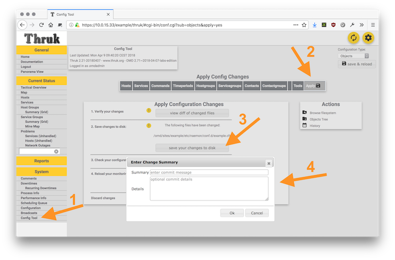
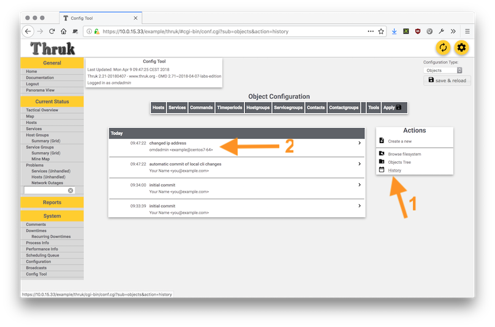

## GIT Integration

### Expected Result

 * A git repository for your omd site
 * Automatic commits when changing configuration within Thruks config tool

### Notes

OMD is prepared to be fully versioned by git. This works quite well, because OMD
separates strictly between packaged software and user configuration files. So we
can easily put the complete site under version control.

### Steps

#### Initialize the git repository

Create an empty repository for your site:

```
OMD[example]:~$ git init
Initialized empty Git repository in /opt/omd/sites/example/.git/
```

Commit the current state:

```
OMD[example]:~$ git config --global user.email "you@example.com"
OMD[example]:~$ git config --global user.name "Your Name"
OMD[example]:~$ git add .
OMD[example]:~$ git commit -v -m 'initial commit'
```

Verify if it worked:

```
OMD[example]:~$ git status
# On branch master
nothing to commit, working directory clean

OMD[example]:~$ git log
commit a4e1a6c55f574ec2df3494000fb3ec3a6c54a68f
Author: Your Name <you@example.com>
Date:   Mon Apr 9 09:34:00 2018 +0200

  initial commit
```

#### Enable thruk hooks

Thruk ships an example hook which can be used right away. All we need to
do is to enable the hooks.

```
OMD[example]:~$ cat > etc/thruk/thruk_local.d/git.conf <<EOF
<Component Thruk::Plugin::ConfigTool>
    pre_obj_save_cmd    = ./share/thruk/examples/config_tool_git_checkin
    post_obj_save_cmd   = ./share/thruk/examples/config_tool_git_checkin
</Component>
EOF
```

This hook will commit everything below `./etc/core/conf.d` whenever you hit the
save button.

#### Test it

Reload apache so Thruk will read the new configuration:
```
OMD[example]:~$ omd reload apache
```

Then change something within Thruks config tool and if everything worked, you
will see a popup to enter a change summary when hitting the save button:



Enter something and hit `OK`.

Now you should see this commit in the history page:



And in the command line:

```
OMD[example]:~$ git log -1
commit 288d793af7f58ecf3813dcc39d0581d8d196e944
Author: omdadmin <example@centos7-64>
Date:   Mon Apr 9 09:47:22 2018 +0200

    changed ip address

    (automatic commit of config tool changes (omdadmin))
```
