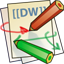
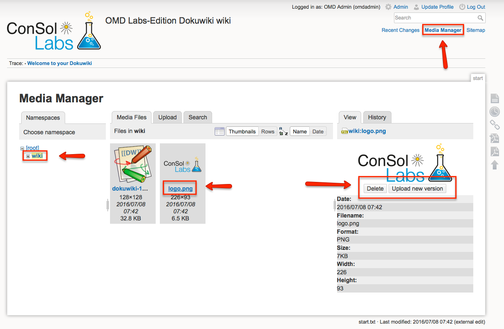

### Overview

|||
|---|---|
|Homepage:|http://www.dokuwiki.org/dokuwiki#|
|Changelog:|https://www.dokuwiki.org/changes|
|Documentation:|https://www.dokuwiki.org/manual|
|Get version:|Is displayed at the footer of every WUI page|
|OMD default:|enabled|
|OMD URL:|/&lt;site&gt;/wiki|

DokuWiki is a simple to use and highly versatile Open Source wiki software that doesn't require a database.

&#x205F;
### Directory Layout

|||
|---|---|
|Config Directory:|&lt;site&gt;/etc/dokuwiki|
|Logfiles:|view apache logfiles &lt;site&gt;/var/log/apache|
|Data Directory:|&lt;site&gt;/var/dokuwiki/data|
|Plugin Directory:|&lt;site&gt;/var/dokuwiki/lib/plugins|

&#x205F;

### OMD Options & Vars
| Option | Value | Description |
| ------ |:-----:| ----------- |
| DOKUWIKI_AUTH | on   **off** | Change userauth from default (Nagios) htpasswd to managed by DokuWiki WUI |

### Dokuwiki Plugins
Starting of the 2015-10-13 snapshot, it is possible to install own plugins
within the dokuwiki installation of OMD. Those plugins which are shipped
with OMD are symlinked into the plugin folder. Manually installed plugins
get directly installed into that folder. Shipped plugins are updated
automatically with each OMD release. Manual plugins have to be updated
within the plugin manager of dokuwiki.

### Changing Dokuwiki Logo

  * Open the Media Manager
  * Expand the `wiki` folder
  * Select the `logo.png`
  * Click `Upload a new version`

