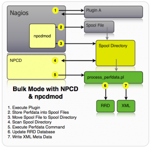

### Overview

|||
|---|---|
|Homepage:|http://docs.pnp4nagios.org|
|Changelog:|http://docs.pnp4nagios.org/pnp-0.6/dwnld#changelog|
|Documentation:|https://docs.pnp4nagios.org/pnp-0.6/start|
|Get version:|Is displayed at the footer of every WUI page|
|OMD default:|enabled|
|OMD URL:|/&lt;site&gt;/pnp4nagios|

PNP is an addon to Nagios which analyzes performance data provided by plugins and stores them automatically into RRD-databases.

&#x205F;
### Directory Layout

|||
|---|---|
|Config Directory:|&lt;site&gt;/etc/pnp4nagios|
|Logfiles:|&lt;site&gt;/var/pnp4nagios/log|

&#x205F;
### OMD Options & vars
| Option | Value | Description |
| ------ |:-----:| ----------- |
| PNP4NAGIOS | **on**   off | Disable PNP4nagios (default on) |

Own adjustments should be made in `<site>/etc/pnp4nagios/config_local.php` If this file does not exist the file `config.php` can be taken as a guideline.

