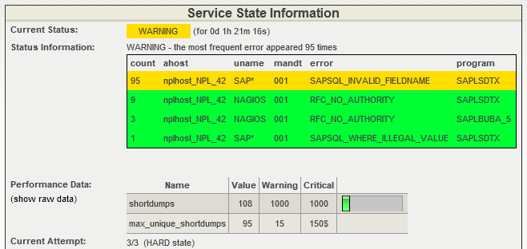
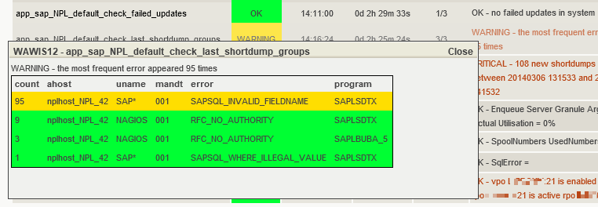
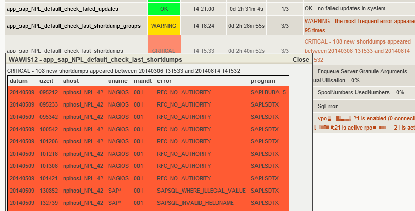
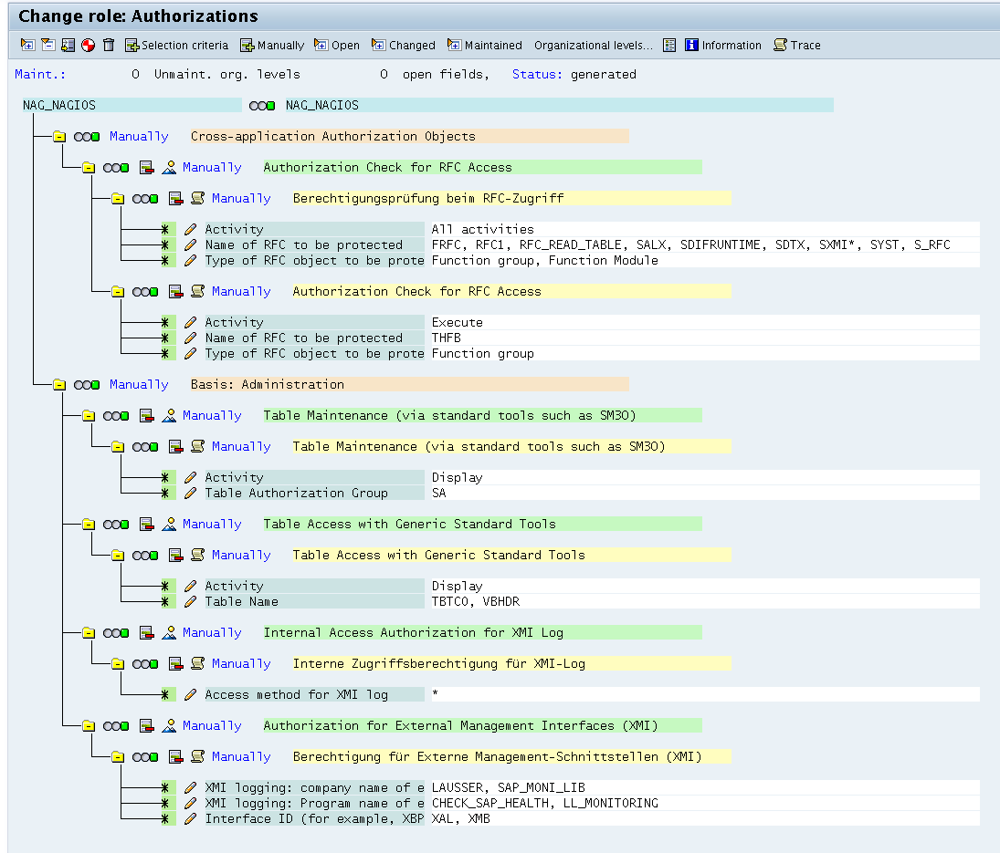

## Description

check_sap_health is a plugin designed to monitor SAP NetWeaver instances. It was developed as an easily extensible tool to monitor both technical parameters from the CCMS (Computing Center Management System) as well as business-related facts via RFC/BAPI.

The plugin communicates either with a Solution Manager or directly with application servers. Monitoring of SAP load balancing is also possible by connecting to the message server of a central instance.

With check_sap_health it is possible to monitor:
- CCMS metrics (using SAP's own thresholds or defining custom thresholds)
- Background jobs (duration as well as exit status)
- Short dumps and failed updates
- Process counts and workload analysis
- IDoc status verification

A highlight of this plugin is its simple API which allows users to write small extensions to monitor individual business logic using the RFC/BAPI interface.

## Installation

The plugin requires the SAP NetWeaver RFC SDK and the Perl module `sapnwrfc`. In OMD, the plugin is already included; only the SDK and its dependencies need to be installed separately.

### Prerequisites

1. **SAP NetWeaver RFC SDK**: Download from SAP Service Marketplace
2. **SAP Cryptographic Library**: Required for SNC (Secure Network Communication)
3. **Perl module sapnwrfc**: Available from https://github.com/lausser/perl-sapnwrfc

### Installation Steps

1. Download the NW RFC SDK from SAP
2. Extract using SAPCAR tool
3. Clone and install the Perl module:
   ```bash
   git clone https://github.com/lausser/perl-sapnwrfc.git
   cd perl-sapnwrfc
   perl Makefile.PL --source /path/to/nwrfcsdk
   make
   make install
   ```
4. Copy the shared libraries to your OMD site's library directory

For detailed SNC setup instructions, see our blog post: [Using check_sap_health with SNC](/blog/2025/12/02/using-check_sap_health-with-snc/)

## Command Line Parameters

### Connection Parameters

* **\--hostname** / **\--ashost**
  The hostname or IP address of the SAP application server.

* **\--sysnr**
  The SAP system number (instance number).

* **\--username**
  The SAP user for RFC connection.

* **\--password**
  Password of the SAP user.

* **\--client**
  The SAP client number. Default: 001

* **\--lang**
  The language for connection. Default: EN

* **\--mshost**
  The message server hostname (for load balancing).

* **\--msserv**
  The message server port.

* **\--r3name**
  The SAP system ID (SID) when connecting via message server.

* **\--saprouter**
  SAP Router connection string (e.g., `/H/router.example.com`). Routes the connection through an SAP Router, which can be combined with SNC for encrypted communication through a single gateway.

### Filtering Parameters

* **\--name**
  Filter for specific objects (usage depends on mode).

* **\--name2**
  Additional filter parameter for narrowing results.

* **\--name3**
  Third level filter parameter.

* **\--regexp**
  Treat name filters as regular expressions.

### Operational Parameters

* **\--mode**
  Specifies what the plugin should check. See "Modes" section below for available values.

* **\--lookback**
  Time window in seconds for historical data analysis.

* **\--separator**
  Separator character for MTE (Monitoring Tree Element) paths. Default: ->

* **\--mtelong**
  Output complete MTE paths in plugin output.

### Threshold Parameters

* **\--warning** / **\--warningx**
  Warning threshold. Use \--warningx to override SAP's default thresholds.

* **\--critical** / **\--criticalx**
  Critical threshold. Use \--criticalx to override SAP's default thresholds.

### Output Parameters

* **\--report** <short|long|html>
  Output format for the check results.

### SNC (Secure Network Communication) Parameters

* **\--snc**
  Enable SNC protocol for encrypted communication. Sets environment variable `SNC_MODE=1`.

* **\--secudir**
  Directory containing the `SAPSNCS.pse` file (Personal Security Environment).

* **\--snc-lib**
  Path to the `libsapcrypto.so` library. If not specified, the plugin searches `LD_LIBRARY_PATH`.

* **\--snc-myname**
  SNC name identifying the monitoring system (sets `SNC_MYNAME`).

* **\--snc-partnername**
  Distinguished Name (DN) of the SAP system's certificate (sets `SNC_PARTNERNAME`).

* **\--snc-qop**
  Quality of Protection level (sets `SNC_QOP`). Default: 3
  - 1 = Authentication only
  - 2 = Integrity protection
  - 3 = Privacy protection (encryption)
  - 8 = Use default protection
  - 9 = Maximum protection

### Extension Parameters

* **\--with-mymodules-dyn-dir**
  Directory path for custom extension modules.

## Modes

check_sap_health supports various modes for different monitoring tasks:

### Connection Testing

| Mode | Description |
|------|-------------|
| connection-time | Measures how long connection establishment and login take |

### CCMS Monitoring

| Mode | Description |
|------|-------------|
| list-ccms-monitor-sets | Lists all available CCMS monitor sets |
| ccms-mte-check | Checks specific CCMS Monitoring Tree Elements |

### Short Dump Analysis

| Mode | Description |
|------|-------------|
| shortdumps-list | Lists all short dumps |
| shortdumps-count | Counts short dumps within a time window |
| shortdumps-recurrence | Monitors recurring short dumps |

#### Short Dumps Monitoring Examples

The plugin provides detailed monitoring of SAP short dumps with visual feedback in monitoring interfaces:

**Recurring Short Dumps Detection:**



*The plugin tracks short dump patterns and alerts on recurring issues*



*Detailed popup showing short dump analysis and history*

**Short Dumps Count:**



*Count-based monitoring with configurable thresholds and time windows*

### Job Monitoring

| Mode | Description |
|------|-------------|
| list-jobs | Lists background jobs |
| failed-jobs | Checks for failed background jobs |
| exceeded-failed-jobs | Monitors jobs that exceeded their expected runtime |

### Process Monitoring

| Mode | Description |
|------|-------------|
| list-processes | Lists SAP work processes |
| count-processes | Counts work processes by type |

### IDoc Monitoring

| Mode | Description |
|------|-------------|
| list-idocs | Lists IDocs |
| failed-idocs | Checks for failed IDocs |

### System Analysis

| Mode | Description |
|------|-------------|
| failed-updates | Checks for failed update requests |
| workload-overview | Analyzes system workload statistics |

## Extensions

check_sap_health can be extended with custom functionality through Perl modules. This allows you to monitor business-specific metrics and processes.

### Creating Custom Modules

1. Create a Perl module following the naming convention: `CheckSapHealth*.pm`
2. Place the module in `$OMD_SITE/etc/check_sap_health/`
3. The module must inherit from `Classes::SAP::Netweaver::Item`
4. Use the `--with-mymodules-dyn-dir` parameter to specify the module directory

### Example Module Structure

```perl
package CheckSapHealthCustom;

use strict;
use base qw(Classes::SAP::Netweaver::Item);

sub init {
  my ($self) = @_;
  # Your initialization code
}

sub nagios {
  my ($self) = @_;
  # Your check logic
  # Set $self->{nagios_level} and $self->{nagios_message}
}

1;
```

## Examples

### Basic Connection Test

```bash
check_sap_health \
  --hostname sap.example.com \
  --sysnr 00 \
  --username nagios \
  --password secret \
  --client 100 \
  --mode connection-time
```

### CCMS Monitoring with Filters

```bash
check_sap_health \
  --hostname sap.example.com \
  --sysnr 00 \
  --username nagios \
  --password secret \
  --client 100 \
  --mode ccms-mte-check \
  --name "SAP CCMS Monitor Templates" \
  --name2 "Dialog Overview" \
  --name3 "ResponseTime" \
  --mtelong
```

### Monitoring via Message Server (Load Balancing)

```bash
check_sap_health \
  --mshost sap-msg.example.com \
  --msserv 3600 \
  --r3name PRD \
  --username nagios \
  --password secret \
  --client 100 \
  --mode workload-overview
```

### Secure Connection with SNC

```bash
check_sap_health \
  --hostname sap.example.com \
  --sysnr 00 \
  --username nagios \
  --password secret \
  --client 100 \
  --mode ccms-mte-check \
  --name "Dialog" \
  --snc \
  --secudir /omd/sites/mysite/etc/check_sap_health/sec \
  --snc-partnername "p:CN=SAP_PRD,O=Company,C=DE"
```

### Using SAP Router

```bash
check_sap_health \
  --saprouter "/H/router.example.com" \
  --hostname sap.example.com \
  --sysnr 00 \
  --username nagios \
  --password secret \
  --client 100 \
  --mode connection-time
```

## Threshold Syntax

Thresholds follow the Nagios plugin development guidelines:

* `10` means "Alarm if > 10"
* `10:` means "Alarm if < 10"
* `10:20` means "Alarm if < 10 or > 20"
* `@10:20` means "Alarm if between 10 and 20"

## Directory Layout in OMD

| Path | Description |
|------|-------------|
| `<site>/lib/nagios/plugins/` | Binary directory (provided by OMD Release) |
| `<site>/local/lib/` | Library directory for SDK files |
| `<site>/etc/check_sap_health/` | Configuration and extension modules |

## SAP Permissions

The SAP user used for monitoring requires specific authorizations. The minimal authorization profile should include:

* RFC function groups for CCMS access
* Read access to background job tables
* Access to system monitoring functions



*Required SAP authorizations and access levels for monitoring operations*

Consult your SAP Basis team to create an appropriate monitoring user with restricted permissions. The diagram above shows the complete authorization hierarchy needed for full plugin functionality.

## Resources

* **GitHub Repository**: https://github.com/lausser/check_sap_health
* **Changelog**: https://github.com/lausser/check_sap_health/blob/master/ChangeLog
* **Perl Module (sapnwrfc)**: https://github.com/lausser/perl-sapnwrfc

## Author & License

**Author**: Gerhard Laußer, ConSol Labs

**License**: GNU General Public License

## See Also

* [Using check_sap_health with SNC](/blog/2025/12/02/using-check_sap_health-with-snc/) - Detailed guide for setting up SNC
* [OMD Packages](/docs/omd/packages/) - Overview of included monitoring plugins
