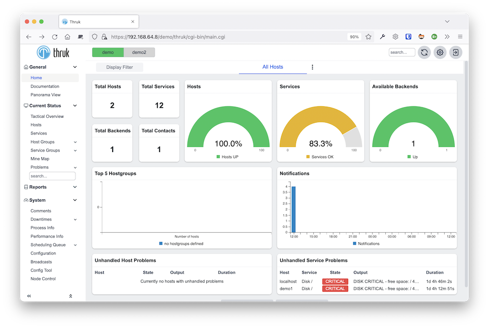
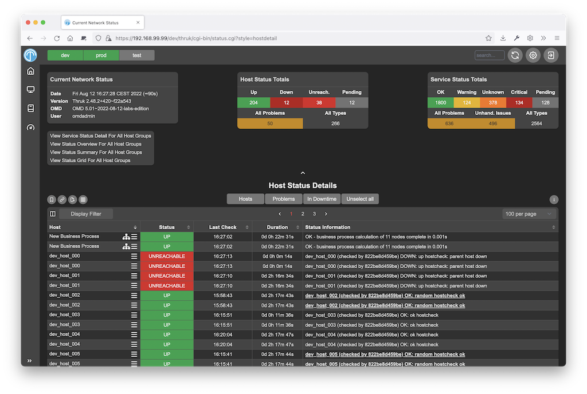

[Thruk](https://www.thruk.org) is a multibackend monitoring webinterface which currently supports Naemon, Nagios, Icinga and Shinken as backend using the Livestatus API.

It is designed to be a 'dropin' replacement and covers almost 100% of the original features plus adds additional enhancements for large installations and increased usability.

It is included in [OMD](docs/omd/). Sven Nierleins' OSMC 2022 talk on the redesign can be found on [youtube](https://www.youtube.com/watch?v=ikMp5M3kt3k).

## Main Features / Advantages

- Multiple backends
- Fast and efficient
- Clusterable
- Modern design
- Dashboards
- Powerful REST API
- Advanced filtering
- Darkmode and other themes
- Mobile friendly
- SLA Reporting + XLS Exports
- Recurring Downtimes
- Business Process Addon
- ...

You can find more details [here](https://www.thruk.org/documentation/introduction.html#_reasons-to-choose-thruk).

## Screenshots

## Download
Thruk is included in [OMD](docs/omd/) but you can find all packages [here](https://www.thruk.org/download.html).