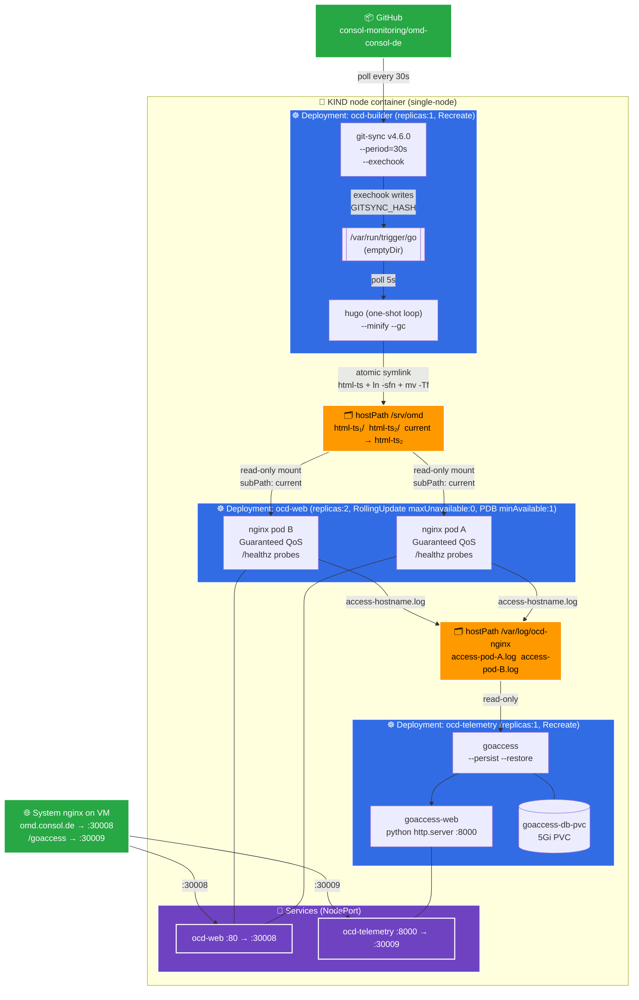

# omd.consol.de — Kubernetes Deployment

This folder holds the Kubernetes manifests that run **omd.consol.de** inside a
single-node KIND cluster on the production VM. Every `git push` to the GitHub
repository automatically triggers a Hugo rebuild and publishes the new site
within seconds — no manual steps required.

---

## Architecture


```mermaid
flowchart TB
    GH[📦 GitHub<br/>consol-monitoring/omd-consol-de]
    SysNginx[🌐 System nginx on VM<br/>omd.consol.de → :30008<br/>/goaccess → :30009]

    subgraph Docker["🐳 KIND node container (single-node)"]

        subgraph Builder["☸️ Deployment: ocd-builder (replicas:1, Recreate)"]
            direction LR
            GS["git-sync v4.6.0<br/>--period=30s<br/>--exechook"]
            TRIG[["/var/run/trigger/go<br/>(emptyDir)"]]
            HUGO["hugo (one-shot loop)<br/>--minify --gc"]
            GS -->|exechook writes<br/>GITSYNC_HASH| TRIG
            TRIG -->|poll 5s| HUGO
        end

        subgraph HP1["🗂 hostPath /srv/omd<br/>html-ts₁/  html-ts₂/  current → html-ts₂"]
        end

        subgraph Web["☸️ Deployment: ocd-web (replicas:2, RollingUpdate maxUnavailable:0, PDB minAvailable:1)"]
            direction LR
            NGX1[nginx pod A<br/>Guaranteed QoS<br/>/healthz probes]
            NGX2[nginx pod B<br/>Guaranteed QoS<br/>/healthz probes]
        end

        subgraph HP2["🗂 hostPath /var/log/ocd-nginx<br/>access-pod-A.log  access-pod-B.log"]
        end

        subgraph Tele["☸️ Deployment: ocd-telemetry (replicas:1, Recreate)"]
            direction LR
            GA[goaccess<br/>--persist --restore]
            GAW[goaccess-web<br/>python http.server :8000]
            PVC[(goaccess-db-pvc<br/>5Gi PVC)]
            GA --> GAW
            GA --- PVC
        end

        subgraph Svcs["🔌 Services (NodePort)"]
            SVCW[ocd-web :80 → :30008]
            SVCT[ocd-telemetry :8000 → :30009]
        end

        HUGO -->|atomic symlink<br/>html-ts + ln -sfn + mv -Tf| HP1
        HP1 -->|read-only mount<br/>subPath: current| NGX1
        HP1 -->|read-only mount<br/>subPath: current| NGX2
        NGX1 -->|access-hostname.log| HP2
        NGX2 -->|access-hostname.log| HP2
        HP2 -->|read-only| GA
        NGX1 --- SVCW
        NGX2 --- SVCW
        GAW  --- SVCT
    end

    GH -->|poll every 30s| GS
    SysNginx -->|:30008| SVCW
    SysNginx -->|:30009| SVCT

    classDef dep fill:#326ce5,stroke:#fff,stroke-width:2px,color:#fff
    classDef host fill:#ff9900,stroke:#fff,stroke-width:2px,color:#000
    classDef ext fill:#28a745,stroke:#fff,stroke-width:2px,color:#fff
    classDef svc fill:#6f42c1,stroke:#fff,stroke-width:2px,color:#fff

    class Builder,Web,Tele dep
    class HP1,HP2 host
    class GH,SysNginx ext
    class Svcs,SVCW,SVCT svc
```

### Update flow

```
GitHub commit
    ↓
git-sync polls every 30 s, pulls to /tmp/git/ocd
    ↓
--exechook-command writes GITSYNC_HASH → /var/run/trigger/go
    ↓
hugo loop notices new hash, builds into /srv/omd/html-<ts>
    ↓
ln -sfn html-<ts> current.new  &&  mv -Tf current.new current   (atomic swap)
    ↓
nginx (both replicas) serve the new tree on the next request
    ↓
system nginx on the VM forwards omd.consol.de → :30008
```

Build and serve run in separate pods with separate cgroups. The only shared
state is the `/srv/omd/current` symlink, which flips atomically.

---

## Deployments and Services

| Deployment | Replicas | Job |
|---|---|---|
| `ocd-builder` | 1 (`Recreate`) | Pulls GitHub repo, rebuilds Hugo site on every commit. |
| `ocd-web` | 2 (`RollingUpdate`, `maxUnavailable: 0`, PDB `minAvailable: 1`) | Serves the static site with nginx. Stateless. |
| `ocd-telemetry` | 1 (`Recreate`) | Runs GoAccess over the shared nginx logs and serves the HTML report. |

| Service | NodePort | Backend |
|---|---|---|
| `ocd-web` | **30008** | website (nginx :80) |
| `ocd-telemetry` | **30009** | GoAccess report (python http.server :8000) |

The system nginx on the VM forwards `omd.consol.de` → `localhost:30008` and
`/goaccess` → `localhost:30009` (see `omdconsolde.conf` for the reference
config). It also serves `/repo/stable` and `/repo/testing` directly from the
VM filesystem — those paths are outside Kubernetes.

---

## Why it's robust and automatic

| Failure mode | What happens |
|---|---|
| Bad commit causes Hugo crash / OOM | `ocd-builder` restarts; `current` still points at the last good build; site keeps serving. |
| nginx process crash | Liveness probe fails → kubelet restarts the container; the other replica keeps serving. |
| Rolling nginx update | `maxUnavailable: 0` + PDB guarantee one Ready replica at all times. |
| Node memory/CPU pressure | Guaranteed-QoS `ocd-web` pods are evicted last. |
| Long or slow Hugo build | No effect on serving — separate cgroup, atomic content publication. |
| git-sync transient failure | Retries every 30 s; last-good content stays published. |

Key design choices:

- **Build/serve separation** — `ocd-builder` has its own CPU/memory limits (`1000m` / `1024Mi`); a runaway Hugo build cannot starve nginx.
- **Atomic publication** — Hugo writes a complete tree to `/srv/omd/html-<ts>/`, then swaps the `current` symlink with `mv -Tf`. nginx never observes a half-written site.
- **Stateless serving tier** — `ocd-web` mounts the HTML tree read-only. The only thing that can break it is a process crash, which the liveness probe catches in ≤10 s.
- **GoAccess isolation** — analytics run in their own pod; a CPU spike there never reaches the serving tier. History is persisted in a PVC and survives pod restarts.

---

## File layout

```
deployment/
├── ocd-10-namespace.yml      # Namespace: ocd
├── ocd-11-configmaps.yml     # git-repo, git-config, git-sync-hooks,
│                             #   nginx-conf, goaccess-config
├── ocd-14-volumes.yml        # goaccess-db-pvc (5 Gi)
├── ocd-15-builder.yml        # Deployment: ocd-builder  (git-sync + hugo)
├── ocd-16-web.yml            # Deployment: ocd-web      (nginx × 2 + PDB)
├── ocd-17-telemetry.yml      # Deployment: ocd-telemetry (goaccess + web)
├── ocd-19-service.yml        # Services: ocd-web (30008), ocd-telemetry (30009)
├── omdconsolde.conf          # reference system-nginx config on the VM
├── goaccess_exclude.txt      # reference; active copy is in ocd-11 ConfigMap
└── README.md                 # this file
```

Node-level directories shared between pods (hostPath, `DirectoryOrCreate`):

| Path (inside the KIND node container) | Writer | Reader(s) |
|---|---|---|
| `/srv/omd` | `ocd-builder` / `hugo` | `ocd-web` / nginx (read-only) |
| `/var/log/ocd-nginx` | `ocd-web` per replica | `ocd-telemetry` / goaccess (read-only) |

---

## Installation

The cluster runs inside a Docker container managed by **kind**:

```
kind create cluster --name ocd
```

### First-time deploy

Apply in two phases so `ocd-builder` publishes `current` before the web
replicas come up:

```bash
# 1. namespace, config, storage
kubectl apply -f ocd-10-namespace.yml \
              -f ocd-11-configmaps.yml \
              -f ocd-14-volumes.yml

# 2. builder — wait until /srv/omd/current exists
kubectl apply -f ocd-15-builder.yml
kubectl -n ocd logs deploy/ocd-builder -c hugo -f
# watch for: "[hugo] published rev=<sha> as <ts>"

# 3. serving tier + services
kubectl apply -f ocd-16-web.yml \
              -f ocd-17-telemetry.yml \
              -f ocd-19-service.yml
```

Verify:

```bash
kubectl -n ocd get deploy,pods,svc
# ocd-builder 1/1   ocd-web 2/2   ocd-telemetry 1/1
# NodePort Services on 30008 / 30009
```

### Re-applying after a change

```bash
kubectl apply -f .
```

This is idempotent for all existing objects.

---

## Updating the Hugo image

The builder uses `docker.io/floryn90/hugo:<version>-ext-alpine` directly — the
extended Alpine variant is required for SCSS. To upgrade:

```yaml
# ocd-15-builder.yml
image: docker.io/floryn90/hugo:<new-version>-ext-alpine
```

```bash
kubectl apply -f ocd-15-builder.yml
```

`ocd-builder` restarts with the new image; the serving tier is unaffected.

---

## Operational checks

```bash
# overall status
kubectl -n ocd get deploy,pods,svc,pdb

# most recent Hugo build
kubectl -n ocd logs deploy/ocd-builder -c hugo --tail=50

# currently published build
kubectl -n ocd exec deploy/ocd-builder -c hugo -- ls -l /srv/omd/current

# web readiness (should always be 2)
kubectl -n ocd get endpoints ocd-web

# per-replica access log
kubectl -n ocd logs deploy/ocd-web -c logger --tail=50

# test NodePorts from the VM
curl -sI http://127.0.0.1:30008/healthz
curl -sI http://127.0.0.1:30008/
curl -sI http://127.0.0.1:30009/
```

---

## Backup and Restore (GoAccess)

The GoAccess database is the only state that needs a backup — the Hugo site is
regenerated from GitHub automatically on every builder startup.

**Backup** — copy the PVC data from the KIND node's Docker volume to the VM:

```bash
rsync -av /var/lib/docker/volumes/$(docker volume ls -q | grep local-path)/\
_data/local-path-provisioner/ ~/backup/local-path-provisioner/
```

**Restore** — after recreating the cluster, copy the data into the new PVC
before starting the pods (find the new PVC directory under
`/var/lib/docker/volumes/.../local-path-provisioner/`):

```bash
docker run --rm \
  -v $HOME/backup/local-path-provisioner:/backup:ro \
  -v $(docker volume ls -q | grep local-path):/data \
  alpine \
  sh -c "cp -r /backup/pvc-*_ocd_goaccess-db-pvc/. \
    /data/local-path-provisioner/pvc-*_ocd_goaccess-db-pvc/"
```
