## Installation

Kubernetes runs inside a Docker container. The container is created with the **kind** command.

```
root:~# kind create cluster --name ocd
Creating cluster "ocd" ...
 ✓ Ensuring node image (kindest/node:v1.35.0)
 ✓ Preparing nodes
 ✓ Writing configuration
 ✓ Starting control-plane
 ✓ Installing CNI
 ✓ Installing StorageClass
Set kubectl context to "kind-ocd"
You can now use your cluster with:

kubectl cluster-info --context kind-ocd

Not sure what to do next? Check out https://kind.sigs.k8s.io/docs/user/quick-start/

root:~# kubectl cluster-info --context kind-ocd
Kubernetes control plane is running at https://127.0.0.1:36707
CoreDNS is running at https://127.0.0.1:36707/api/v1/namespaces/kube-system/services/kube-dns:dns/proxy

To further debug and diagnose cluster problems, use 'kubectl cluster-info dump'.
```

The **kind create** command also updates or creates `~/.kube/config`:

```
root:~# kubectl get ns
NAME                 STATUS   AGE
default              Active   69s
kube-node-lease      Active   69s
kube-public          Active   69s
kube-system          Active   69s
local-path-storage   Active   65s
```

Deployment of the containers, volumes, and services:

```
root:~/deployment# kubectl apply -f .
namespace/ocd configured
configmap/git-repo configured
persistentvolumeclaim/nginx-logs-pvc configured
persistentvolumeclaim/goaccess-db-pvc configured
configmap/git-config configured
configmap/goaccess-config configured
deployment.apps/omd-consol-de configured
service/omd-consol-de-service configured
```

---

## Setup of the Deployment

### git-sync-init (Init Container)

This init container performs a one-time clone of the **omd-consol-de** repository from GitHub into the `content` volume. It runs before the main containers start, ensuring the repository is available when Hugo begins watching for changes.

### git-sync

This container continuously watches the repository **omd-consol-de** on GitHub. When an update is detected, it performs a `git pull` into the `content` volume.

### hugo

This container watches the `content` volume for file system events and immediately regenerates the website into the `html` volume.

### nginx

This container serves the files from the `html` volume on port 80.

### logger

This container tails the nginx access logs from the shared `nginx-logs` volume to stdout, making the logs visible via `kubectl logs` for monitoring and debugging.

### goaccess

This container processes nginx access logs every 60 seconds to generate real-time web analytics. It creates HTML reports and persists its database to the `goaccess-db-pvc` PersistentVolume.

### goaccess-web

This container runs a Python HTTP server that serves the goaccess analytics dashboard on port 8000.

### omd-consol-de-service

This service exposes a NodePort **30008** and forwards incoming requests to the nginx container. Incoming internet traffic is forwarded by the system nginx according to the rules defined in `/etc/nginx/sites-enabled/omdconsolde.conf`.

The system nginx handles:
- `/` → Forwards to Kubernetes nginx (main website)
- `/repo/stable` and `/repo/testing` → Forwards to local filesystem paths on the host

---

## Updating the OCD Container Image

If the `Dockerfile` or any content copied into the image has changed, a new tag `image-<version>` must be created and pushed.

This triggers the GitHub Action **"Create and publish a docker image"**, which builds and publishes a new image.

In the deployment folder (part of the **omd-consol-de** repository), update the image reference in:

* `ocd-05-deployment.yml`

```text
ghcr.io/consol-monitoring/ocd:<new-version>
```

Afterwards, copy the deployment folder to the **omd.consol.de** server and run:

```
kubectl apply -f .
```

This causes Kubernetes to restart the OCD container with the new image version.

---

## Disaster Recovery

### 1. Check if the kind container is running

```
root:~/kubevolbackup# docker ps
CONTAINER ID   IMAGE                  COMMAND                  CREATED       STATUS         PORTS                       NAMES
da8d04f66d48   kindest/node:v1.26.3   "/usr/local/bin/entr…"   2 years ago   Up 5 minutes   127.0.0.1:46325->6443/tcp   ocd-control-plane
```

### 2. Save the persistent volumes

```
root:~# mkdir ~/backup
root:~# rsync -av /var/lib/docker/volumes/<hash>/_data/local-path-provisioner ~/backup
```

### 3. Delete the running (hanging) cluster

```
root:~# kind delete cluster --name ocd
Deleting cluster "ocd" ...
Deleted nodes: ["ocd-control-plane"]
```

### 4. Remove leftover Docker containers (if any)

```
docker rm -f <container-id>
```

### 5. Create a new cluster

Follow the instructions in the **Installation** section above.

### 6. Restore the backup

```
root:~/backup# docker stop ocd-control-plane
root:~/backup# docker volume ls
DRIVER    VOLUME NAME
local     826daa77dd7ea71b507465f096b0da681de8d2644faef1423926d753dc84b75c

root:~/backup# docker run --rm -it \
  -v $HOME/backup:/backup:ro \
  -v <volume-name>:/data \
  alpine

/ # ls /data/local-path-provisioner /backup/local-path-provisioner

# copy the goaccess files
/ # cp -r \
  /backup/local-path-provisioner/pvc-7171d69f-ccde-486d-835b-3f1a90dcf870_ocd_goaccess-db-pvc/* \
  /data/local-path-provisioner/pvc-2ffc43a2-d55e-48e2-897e-cac2232719c9_ocd_goaccess-db-pvc

/ # exit
```

### 7. Restart the kind container

```
root:~/backup# docker start ocd-control-plane
```

---

## Appendix: Deployment Architecture Diagram

### Overview

The following diagrams illustrate how updates from GitHub automatically propagate through the deployment to serve updated content.

### Basic Flowchart


### Detailed Flowchart

```mermaid
flowchart TB
    %% External Interfaces
    GH[📦 GitHub<br/>omd-consol-de]
    SysNginx[🌐 System nginx<br/>external access]

    %% Inside Docker container
    subgraph Docker["🐳 Docker Container: ocd-control-plane"]
        subgraph K8s["☸️ Kubernetes Pod: omd-consol-de"]
            subgraph GitSync["Container: git-sync"]
                GS1[Continuous Polling]
                GS2[Detect Changes]
                GS3[Execute git pull]
            end

            subgraph Vol1["📂 Volume: content"]
                CV[Source Files<br/>Markdown, Templates, Assets]
            end

            subgraph HugoC["Container: hugo"]
                HC1[Watch Filesystem<br/>--watch flag]
                HC2[inotify Event]
                HC3[Regenerate Site]
            end

            subgraph Vol2["📂 Volume: html"]
                HV[Generated HTML/CSS/JS]
            end

            subgraph NginxC["Container: nginx"]
                NC1[Serve Static Files<br/>port 80]
            end
        end
    end

    %% Flow connections
    GH -->|1. poll/detect| GS1
    GS1 --> GS2
    GS2 --> GS3
    GS3 -->|2. pull & write| CV
    CV -->|3. file changes| HC1
    HC1 --> HC2
    HC2 --> HC3
    HC3 -->|4. build & write| HV
    HV -->|5. read files| NC1
    NC1 -->|6. serve| SysNginx

    %% Styling
    classDef container fill:#326ce5,stroke:#fff,stroke-width:2px,color:#fff
    classDef volume fill:#ff9900,stroke:#fff,stroke-width:2px,color:#000
    classDef external fill:#28a745,stroke:#fff,stroke-width:2px,color:#fff
    classDef process fill:#17a2b8,stroke:#fff,stroke-width:1px,color:#fff

    class GitSync,HugoC,NginxC container
    class Vol1,Vol2 volume
    class GH,SysNginx external
    class GS1,GS2,GS3,HC1,HC2,HC3,NC1 process
```



### Update Flow Summary

```
GitHub push
    ↓
git-sync detects (continuous polling)
    ↓
git pull → content volume
    ↓
Hugo detects (inotify watch)
    ↓
Hugo rebuild → html volume
    ↓
nginx serves updated files
    ↓
System nginx forwards to users
```

